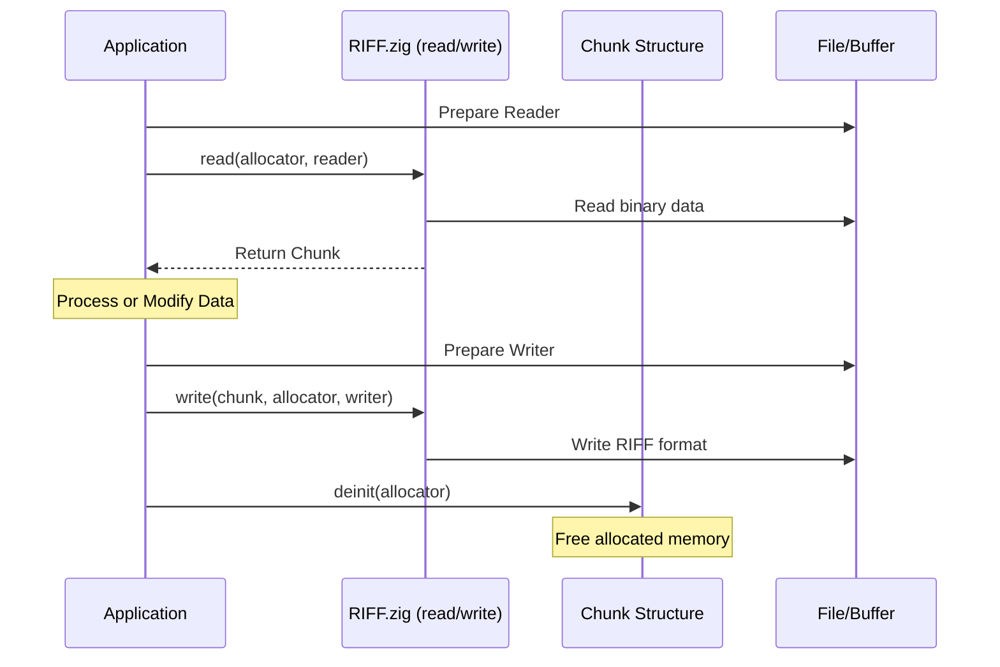

# RIFF.zig

## How to use

```mermaid
sequenceDiagram
    participant App as Application
    participant Lib as RIFF.zig (read/write)
    participant Chunk as Chunk Structure
    participant Storage as File/Buffer

    App->>Storage: Prepare Reader
    App->>Lib: read(allocator, reader)
    Lib->>Storage: Read binary data
    Lib-->>App: Return Chunk

    Note over App: Process or Modify Data

    App->>Storage: Prepare Writer
    App->>Lib: write(chunk, allocator, writer)
    Lib->>Storage: Write RIFF format

    App->>Chunk: deinit(allocator)
    Note over Chunk: Free allocated memory
```
